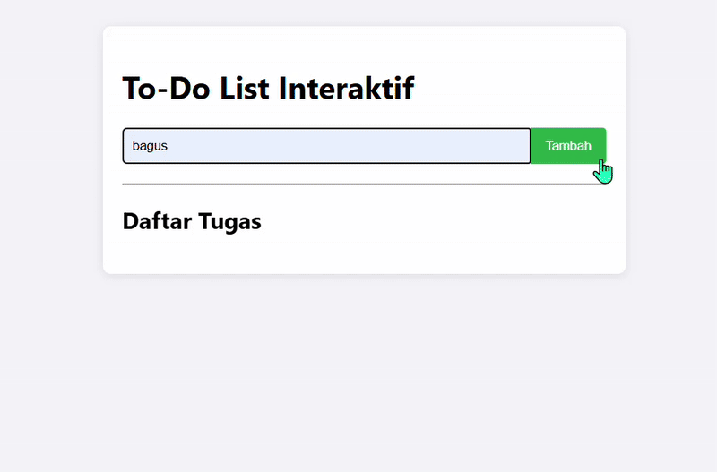

# Proyek To-Do List (JavaScript DOM)


Sebuah aplikasi To-Do List sederhana yang dibuat menggunakan JavaScript murni (vanilla JS) untuk mempraktikkan konsep dasar hingga mahir dari **Document Object Model (DOM)**. Proyek ini adalah hasil akhir dari serangkaian latihan terstruktur.




---

## ✨ Fitur-Fitur

* **Tambah Tugas:** Menambahkan tugas baru ke dalam daftar melalui form input.
* **Hapus Tugas:** Menghapus tugas dari daftar dengan menekan tombol "Hapus".
* **Tandai Selesai:** Memberi tanda pada tugas yang sudah selesai dengan mencoretnya (cukup klik pada teks tugas).
* **Validasi Input:** Form tidak akan mengirim jika input kosong.
* **Desain Bersih:** Tampilan yang sederhana dan mudah digunakan.

---

## 🛠️ Teknologi yang Digunakan

* **HTML5:** Untuk struktur dasar halaman web.
* **CSS3:** Untuk styling dan membuat tampilan menjadi menarik.
* **JavaScript (ES6+):** Untuk semua logika aplikasi, termasuk:
    * Manipulasi DOM (membuat, membaca, mengubah, dan menghapus elemen).
    * Penanganan Events (mendengarkan `submit` pada form dan `click` pada daftar).
    * Event Delegation untuk efisiensi penanganan event.

---

## 🚀 Cara Menjalankan Proyek

1.  Clone repositori ini ke komputermu.
    ```bash
    git clone https://github.com/BagusA23/ToDoList-DOM-.git
    ```
2.  Masuk ke direktori proyek yang baru saja di-clone.
3.  Buka file `latihan-final.html` langsung di browser favoritmu (Google Chrome, Firefox, dll.).
4.  Selesai! Aplikasi To-Do List siap digunakan.

---

## 🧠 Proses Belajar

Proyek ini adalah puncak dari proses belajar JavaScript DOM secara bertahap:

* **Tingkat 1: Memilih Elemen**
    * Mengenal `getElementById`, `querySelector`, `querySelectorAll`, dll. untuk "memegang" elemen HTML.

* **Tingkat 2: Manipulasi Elemen**
    * Mempelajari cara mengubah konten (`textContent`, `innerHTML`), atribut (`href`, `src`), dan style (`style`, `classList`).
    * Mencoba membuat (`createElement`) dan menghapus (`remove`) elemen secara dinamis.

* **Tingkat 3: Events**
    * Membuat halaman menjadi interaktif dengan `addEventListener`.
    * Memahami `event object` (`event.target`, `event.preventDefault`).
    * Mengimplementasikan teknik **event delegation** untuk manajemen event yang efisien, yang menjadi inti dari aplikasi ini.

---

## 👨‍💻 Author

Dibuat dengan penuh semangat oleh **Bagus Ardiansyah**.

Dipandu oleh Asisten AI Gemini dari Google.
